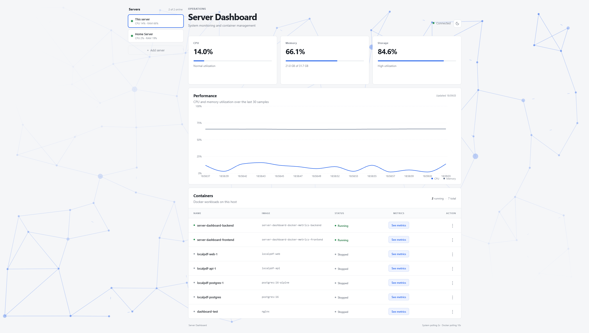
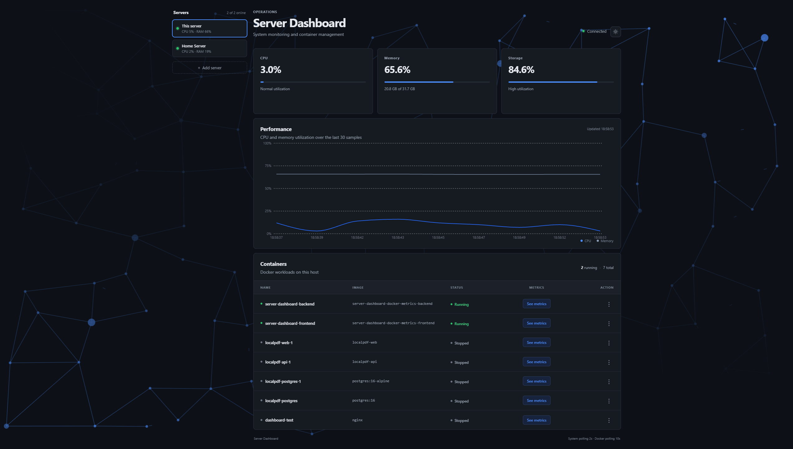
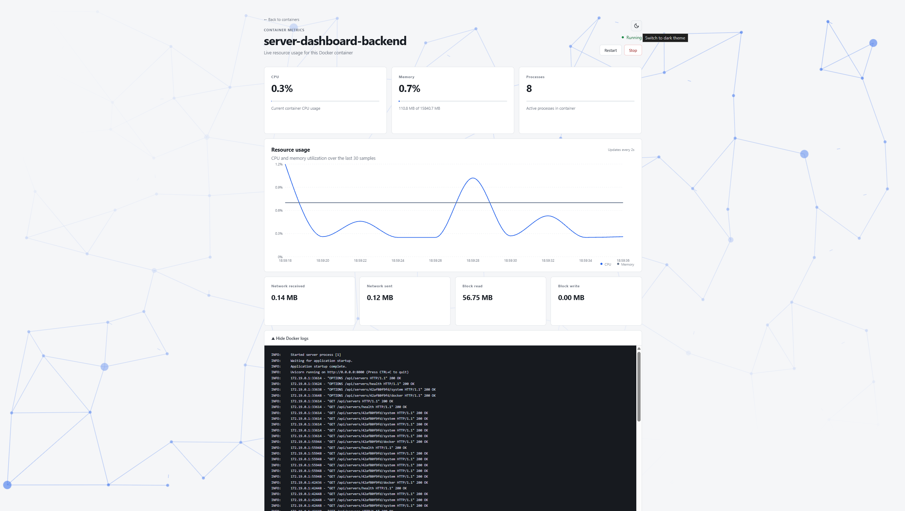
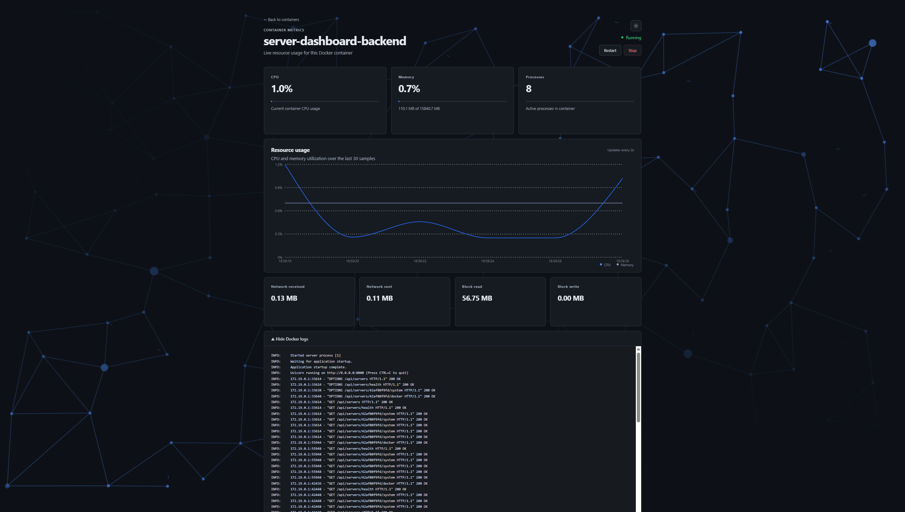
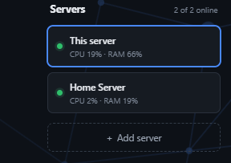
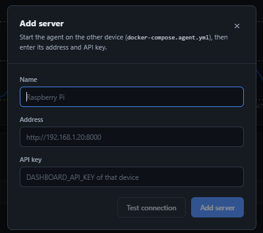

# Server Dashboard

[](README.md)
[](README_TR.md)

Ana makine sistem kaynaklarını (CPU/RAM/disk) izlemek ve Docker konteynerlerini bir web arayüzünden yönetmek için geliştirilmiş küçük bir full-stack uygulama.

- **Frontend**: React 19 + TypeScript + Vite + Recharts
- **Backend**: FastAPI + Uvicorn + psutil + Docker SDK
- **Windows host metrics agent**: PowerShell (Windows ana makine CPU/RAM/C: disk)


## Backend

```bash
cd backend
python -m venv .venv
source .venv/bin/activate   # Windows'ta: .venv\Scripts\activate
pip install -r requirements.txt
uvicorn main:app --reload
```

Ortam değişkenleri (yerel geliştirme için hepsi isteğe bağlıdır):

| Değişken                | Varsayılan                | Amaç                                                                    |
|-------------------------|---------------------------|-------------------------------------------------------------------------|
| `DASHBOARD_API_KEY`     | tanımsız (auth yok)       | Tanımlandığında; Docker başlatma/durdurma/yeniden başlatma/log uç noktaları isteklerde bu değeri içeren bir `X-API-Key` üst bilgisi (header) gerektirir. **Backend'i localhost dışına açmadan önce bu değeri mutlaka ayarlayın.** |
| `DASHBOARD_CORS_ORIGINS`| `http://localhost:3000/`   | İzin verilen frontend kökenlerinin (origins) virgülle ayrılmış listesi.  |

### Rastgele bir anahtar üretmek için:

```bash
   openssl rand -hex 32
```

## Frontend

```bash
cd frontend
npm install
npm run dev
```

Ortam değişkenleri (`frontend/.env`):

| Değişken          | Varsayılan               | Amaç                                          |
|-------------------|--------------------------|-----------------------------------------------|
| `VITE_API_URL`    | `http://127.0.0.1:8000`  | Backend temel URL adresi.                     |
| `VITE_API_KEY`    | tanımsız                 | Tanımlandıysa backend tarafındaki `DASHBOARD_API_KEY` ile aynı olmalıdır. |

## Canlıya Alma (Production) Kontrol Listesi

1. Backend'deki `DASHBOARD_API_KEY` ve frontend'deki `VITE_API_KEY` değerlerini birbiriyle aynı olacak şekilde ayarlayın.
2. `DASHBOARD_CORS_ORIGINS` değerini gerçek frontend alan adınız/alan adlarınız (domain) olacak şekilde güncelleyin.
3. Frontend'i `npm run build` komutuyla derleyin ve `dist/` klasörünü statik bir sunucu veya ters proxy (reverse proxy) üzerinden sunun.
4. Backend'i `--reload` parametresi yerine bir süreç yöneticisi (örn. systemd, Docker) arkasında çalıştırın.
## Windows'ta Docker kullanımı

Uygulama `start.bat` ile başlatıldığında FastAPI backend'i Docker içinde çalışır; küçük bir Windows host metrics agent (`host-agent/host_metrics.ps1`) ise Windows makinesinde `http://localhost:8765` üzerinde dinleyerek çalışır. `/api/system` endpoint'i CPU, RAM ve C: disk kullanımını Linux backend container'ından değil, bu agent'tan alır. `start.bat`, agent'ı küçük bir yeniden-başlatma döngüsü içinde çalıştırır; agent herhangi bir sebeple kapanırsa dashboard host metriksiz kalmadan otomatik olarak yeniden başlatılır.

Dashboard'u başlatmak için `start.bat`, durdurmak için `stop.bat` kullanın.

### Terminalden manuel başlatma

`start.bat` yerine doğrudan `docker compose up` çalıştırırsan, agent senin için **otomatik başlamaz** — önce onu kendi terminalinde ayrıca başlatman gerekir:

```powershell
cd host-agent
powershell -NoProfile -ExecutionPolicy Bypass -File host_metrics.ps1
```

Bu pencereyi açık bırak, ardından ikinci bir terminalde `docker compose up` çalıştır. Agent çalışmıyorsa `/api/system` `503 Service Unavailable` döner (Docker container'larının kendisi ve `/api/docker` bundan etkilenmez, çünkü agent'a bağımlı değiller).

### `/api/system` 503 hatalarında sorun giderme

- **Sadece başlangıçta birkaç tane 503, sonra sürekli 200** — normal. Backend, agent TCP dinleyicisini açmayı bitirmeden sorgulamaya başlıyor; bir-iki saniye içinde kendiliğinden düzeliyor.
- **Hiç bitmeyen, sürekli 503'ler** — agent'a ulaşılamıyor demektir. Şunları kontrol et:
  - `host_metrics.ps1` penceresi hâlâ açık ve çalışıyor mu (`netstat -ano | findstr 8765` bir `LISTENING` satırı göstermeli);
  - Windows Firewall ilk çalıştırmada script'i engellemiş olabilir;
  - çökmüşse elle yeniden başlat (`start.bat` bunu artık otomatik yapıyor).

## Ekran Görüntüleri
> Tam halini görmek için resimlere tıklayın

<table>
  <tr>
    <td align="center">
      <a href="Screenshots/Dashboard-home-page-light.png"></a>
      <br><sub>Açık tema dashboard ana sayfası</sub>
    </td>
    <td align="center">
      <a href="Screenshots/Dashboard-home-page-dark.png"></a>
      <br><sub>Koyu tema dashboard ana sayfası</sub>
    </td>
  </tr>
  <tr>
    <td align="center">
      <a href="Screenshots/Dashboard-Docker-container-page-light.png"></a>
      <br><sub>Açık tema docker metrik sayfası</sub>
    </td>
    <td align="center">
      <a href="Screenshots/Dashboard-Docker-container-page-dark.png"></a>
      <br><sub>Koyu tema docker metrik sayfası</sub>
    </td>
  </tr>
  <tr>
    <td align="center">
      <a href="Screenshots/Dashboard-servers-side-panel.png"></a>
      <br><sub>Server görüntüleme için yan panel</sub>
    </td>
    <td align="center">
      <a href="Screenshots/Dashboard-Add-Server-panel.png"></a>
      <br><sub>Server ekleme paneli</sub>
    </td>
  </tr>
</table>

## Proje Yapısı

```
backend/
  main.py            # FastAPI uygulaması, rotalar, CORS, kimlik doğrulama
  docker_manager.py  # Docker SDK işlemleri
  requirements.txt

frontend/
  src/
    api/dashboardApi.ts  # Tüm backend HTTP çağrıları + ortak tipler
    App.tsx               # Arayüz (UI), durum (state), veri yenileme (polling)
    App.css
```

Kod tabanı büyüdükçe, `App.tsx` içerisindeki arayüz parçalarını `components/` klasörüne ayırabilir ve `App.tsx` dosyasını orkestrasyon/durum katmanı olarak tutabilirsiniz — bu tür bir karmaşıklık gerçekten ortaya çıkana kadar Redux, React Query veya benzeri kütüphanelere ihtiyaç yoktur.